# ADS1291, ADS1292, ADS1292R - Low-Power, 2-Channel, 24-Bit Analog Front-End for Biopotential Measurements

## 1. Description

The ADS1291, ADS1292, and ADS1292R are multichannel, simultaneous sampling, 24-bit, delta-sigma (ΔΣ) ADCs with a built-in PGA, internal reference, and an onboard oscillator. It incorporates all features commonly required in portable, low-power medical electrocardiogram (ECG), sports, and fitness applications.

With high levels of integration and exceptional performance, the ADS1291, ADS1292, and ADS1292R enable the creation of scalable medical instrumentation systems at significantly reduced size, power, and overall cost.

The ADS1291, ADS1292, and ADS1292R have a flexible input multiplexer per channel that can be independently connected to the internally-generated signals for test, temperature, and lead-off detection. Additionally, any configuration of input channels can be selected for derivation of the right leg drive (RLD) output signal. The ADS1291, ADS1292, and ADS1292R operate at data rates up to 8 kSPS. Lead-off detection can be implemented internal to the device, using the device internal excitation current sink or source. The ADS1292R version includes a fully integrated respiration impedance measurement function.

The ADS1291, ADS1292, and ADS1292R have a flexible input multiplexer per channel that can be independently connected to the internally-generated signals for test, temperature, and lead-off detection. Additionally, any configuration of input channels can be selected for derivation of the right leg drive (RLD) output signal. The ADS1291, ADS1292, and ADS1292R operate at data rates up to 8 kSPS. Leadoff detection can be implemented internal to the device, using the device internal excitation current sink or source. The ADS1292R version includes a fully integrated respiration impedance measurement function.

## 2. Overview

The ADS1291, ADS1292, and ADS1292R integrate various electrocardiogram (ECG)-specific functions that make them well-suited for scalable ECG, sports, and fitness applications. The devices can also be used in high-performance, multichannel data acquisition systems by powering down the ECG-specific circuitry.

The ADS1291, ADS1292, and ADS1292R have a highly programmable multiplexer that allows for temperature, supply, input short, and RLD measurements. Additionally, the multiplexer allows any of the input electrodes to be programmed as the patient reference drive. The PGA gain can be chosen from one of seven settings (1, 2, 3, 4, 6, 8, and 12). The ADCs in the device offer data rates from 125 SPS to 8 kSPS. Communication to the device is accomplished using an SPI-compatible interface. The device provides two general-purpose I/O (GPIO) pins for general use. Multiple devices can be synchronized using the START pin.

The internal reference can be programmed to either 2.42 V or 4.033 V. The internal oscillator generates a 512-kHz clock. The versatile right leg drive (RLD) block allows the user to choose the average of any combination of electrodes to generate the patient drive signal. Lead-off detection can be accomplished either by using an external pull-up or pull-down resistor or the device internal current source or sink. An internal ac lead-off detection feature is also available. Apart from the above features, the ADS1292R provides options for internal respiration circuitry.

The internal reference can be programmed to either 2.42 V or 4.033 V. The internal oscillator generates a 512 kHz clock. The versatile right leg drive (RLD) block allows the user to choose the average of any combination of electrodes to generate the patient drive signal. Lead-off detection can be accomplished either by using an external pull-up or pull-down resistor or the device internal current source or sink. An internal ac lead-off detection feature is also available. Apart from the above features, the ADS1292R provides options for internal respiration circuitry.

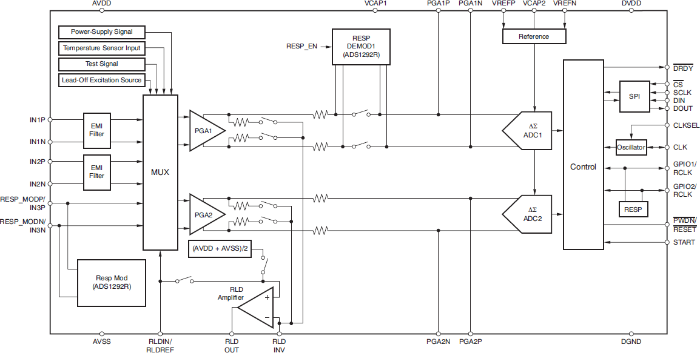

### 2.1. EMI Filter

An RC filter at the input acts as an electromagnetic interference (EMI) filter on channels 1 and 2. The –3 dB filter bandwidth is approximately 3 MHz.

### 2.2. Input Multiplexer

The input multiplexers are very flexible and provide many configurable signal-switching options. The test inputs (TESTP and TESTM) and the RLD input pin (RLDIN/RLDREF) are common to both channels. Negative (INxN) and positive (INxP) inputs are separate for each of the three channels. This flexibility allows for significant device and sub-system diagnostics, calibration, and configuration.

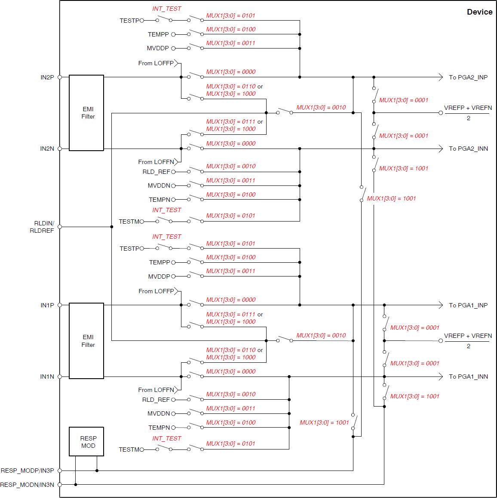

Setting the multiplexer inputs to **shorted** sets the common-mode voltage of  to both inputs of the channel. This setting can be used to test the inherent noise of the device in the user system.

Setting the multiplexer inputs to the internally-generated test signals allows the sub-system verification at power-up. This functionality allows the entire signal chain to be tested out. Test signals are controlled through register settings (CONFIG2 register) where the user can enables the test signal (INT_TEST bit) and switching at the required frequency (TEST_FREQ bit).

In applications where the respiration modulator output is not used, the RESP_MODN/IN3N and RESP_MODN/IN3P signals can be used as a third multiplexed differential input channel. These inputs can be multiplexed to either of the ADC channels.

The device contains an on-chip temperature sensor. This sensor uses two internal diodes with one diode having a current density 16x that of the other; therefore the difference in diode current densities yields a difference in voltage that is proportional to absolute temperature. As a result of the low thermal resistance of the package to the PCB, the internal device temperature tracks the PCB temperature closely, however, the device's self-heating causes a higher reading than the temperature of the surrounding PCB. The temperature reading can be converted to °C using the equation below. Note: before using this equation, the temperature reading code must first be scaled to μV.

Setting the multiplexer inputs to **supply measurement** sets the channel inputs to different supply voltages of the device. For channel 1 value is  and channel 2 is . Note that to avoid saturating the PGA while measuring power supplies, the gain must be set to 1.

The signal at the RLDIN/RLDREF pin can be measured with respect to the midsupply  by setting the channel multiplexer inputs to **RLD_MEASURE**.

The RLDIN/RLDREF pin is primarily used for routing the right leg drive signal to any of the electrodes in case the right leg drive electrode falls off. This is performed by setting the multiplexer inputs to **RLD_DRP**, **RLD_DRM** or **RLD_DRPM**.

### 2.3. Analog Input

The analog input is fully differential, therefore Assuming , the differential input can span between  to . Note that the absolute range for INxP and INxN must be between  and . There are two general methods of driving the device's analog input: single-ended or differential. Note that INxP and INxN are 180°C out-of-phase in the differential input method.

When the input is single-ended, the INxN input is held at the common-mode voltage, preferably at mid-supply; and the INxP input swings around the same common voltage and the peak-to-peak amplitude:  and . When the input is differential, the common-mode is given by , and both INxP and INxN inputs swing from  and .

### 2.4. PGA Settings and Input Range

The PGA is a differential input or differential output amplifier with seven gain settings (1, 2, 3, 4, 6, 8, and 12). Its CMOS inputs provide negligible current noise.

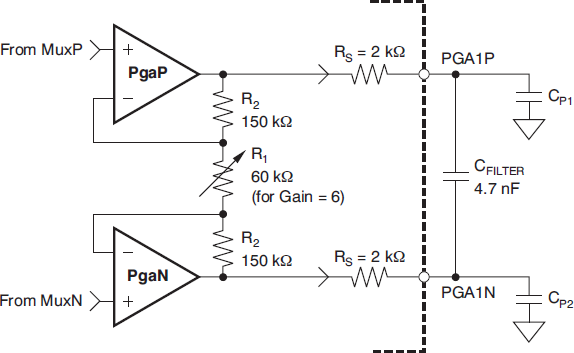

The PGA output is filtered by an RC filter before it goes to the ADC. The filter is formed by an internal resistor of 2 kΩ and an external capacitor CFILTER (4.7 nF, typical). This filter acts as an anti-aliasing filter with the –3 dB bandwidth of 8.4 kHz. The internal resistor is accurate to 15% so actual bandwidth will vary. This RC filter also suppresses the glitch at the PGA output caused by ADC sampling. The minimum capacitor value that can be used is 4 nF. A larger capacitor value can be used for increased attenuation at higher frequencies for anti-aliasing purposes. If channel 1 of the ADS1292R is used for respiration measurement, then a 4.7 nF external capacitor is recommended. The tradeoff is that a larger capacitor value gives degraded THD performance.

The PGA are chopped internally at either 8, 32, or 64 kSPS. The digital decimation filter filters out the chopping ripple in the normal path so the chopping ripple is not a concern. If PGA output is used for hardware PACE detection, the chopping ripple must be filtered. First-order filtering is provided by the RC filter at the PGA output. Additional filtering may be needed to suppress the chopping ripple. If the PGA output is routed to other circuitry, a 20 kΩ series resistance must be added in the path near the CFILTER capacitor. The routing should be matched to maintain the CMRR performance.

The 3 V supply, with a reference of 2.42 V and a gain of 6 for ECGs, is optimized for power with a differential input signal of approximately 300 mV. For higher dynamic range, a 5 V supply with a reference of 4.033 V can be used to increase the differential dynamic range.

### 2.5. ADC Settings

Each channel has a 24-bit ΔΣ ADC. This converter uses a second-order modulator optimized for low-power applications. The modulator sampling clock must be set to 128 kHz, therefore the external clock divider must be set (CLK_DIV) accordingly to the external clock selected (512 kHz or 2,048 kHz).

The on-chip digital decimation filters can be used to filter out the noise at higher frequencies. These on-chip decimation filters also provide antialias filtering. This feature of the ΔΣ converters drastically reduces the complexity of analog antialiasing filters that are typically needed with nyquist ADCs. The digital filter receives the modulator output and decimates the data stream. By adjusting the amount of filtering, tradeoffs can be made between resolution and data rate: filter more for higher resolution, filter less for higher data rates. Higher data rates are typically used in ECG applications for implement software pace detection and ac lead-off detection.

The digital filter on each channel consists of a third-order sinc filter. The decimation ratio on the sinc filters can be adjusted by the DR bits in the CONFIG1 register. This setting is a global setting that affects all channels and, therefore, in a device all channels operate at the same data rate. The sinc filter has notches (or zeroes) that occur at the output data rate and multiples thereof. At these frequencies, the filter has infinite attenuation.

### 2.6. Reference

The internal reference voltage is generated with respect to AVSS. The VREFN pin must always be connected to AVSS. When using a 3 V analog supply, the internal reference must be set to 2.42 V. In case of a 5 V analog supply, the internal reference can be set to 4.033 V.

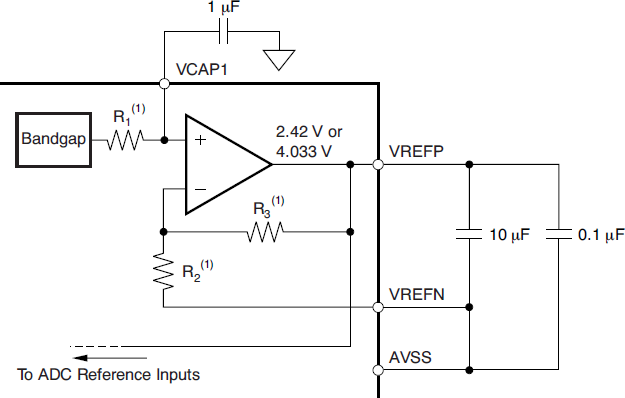

Alternatively, the internal reference buffer can be powered down and VREFP can be applied externally. This power-down is also used to share internal references when two devices are cascaded. By default the device wakes up in external reference mode. It is recommended to use an external reference drive circuitry such the one shown below to minimize the reference noise.

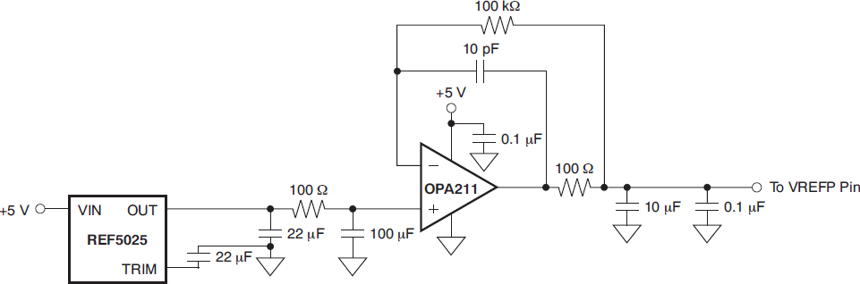

### 2.7. Clock

The device provide two different methods for device clocking: internal and external. Internal clocking is ideally suited for low-power, battery-powered systems. To further increase power saving, it is recommended that during power-down the external clock be shut down. The internal oscillator provides a 512 kHz clock signal and is trimmed for accuracy at room temperature. When multiple devices are used in a daisy-chain configuration, the internal clock can be routed to the CLK pin.

An external clock source can be provided on the CLK pin. Two frequency values can be used (512 kHz or 2.048 MHz), but the clock divider must be set to ensure the modulator is clocked at 128 kHz, regardless of the external clock frequency. The higher frequency option has been provided to allow the SPI to run at a higher speed. SCLK can be only twice the speed of fCLK during a register read or write.

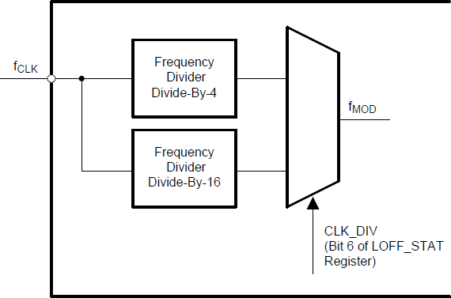

### 2.8. Data Format

The ADS1291, ADS1292, and ADS1292R outputs 24 bits of data per channel in binary twos complement format, MSB first. The LSB has a weight of . A positive full-scale input produces an output code of 7FFFFFh and the negative full-scale input produces an output code of 800000h. The output clips at these codes for signals exceeding full-scale.

### 2.9. ECG-Specific Functions

#### 2.9.1. Input Multiplexer (Rerouting the RLD Signal)

This RLDIN signal can be multiplexed into any one of the input electrodes by setting the MUX bits of the appropriate channel set registers to '0110' for P-side or '0111' for N-side. This feature can be used to dynamically change the electrode that is used as the reference signal to drive the patient body. Note that the corresponding channel cannot be used and can be powered down.

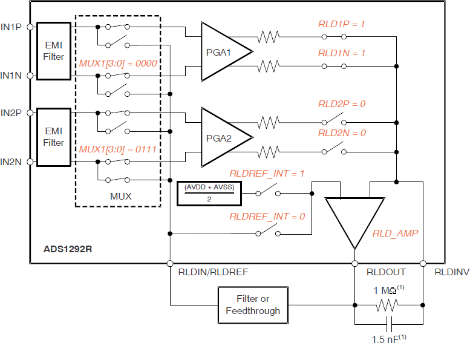

#### 2.9.2. Input Multiplexer (Measuring the Right Leg Drive Signal)

The RLDOUT signal can also be routed to a channel (that is not used for the calculation of RLD) for measurement. The measurement is done with respect to the voltage . This feature is useful for debugging purposes during product development.

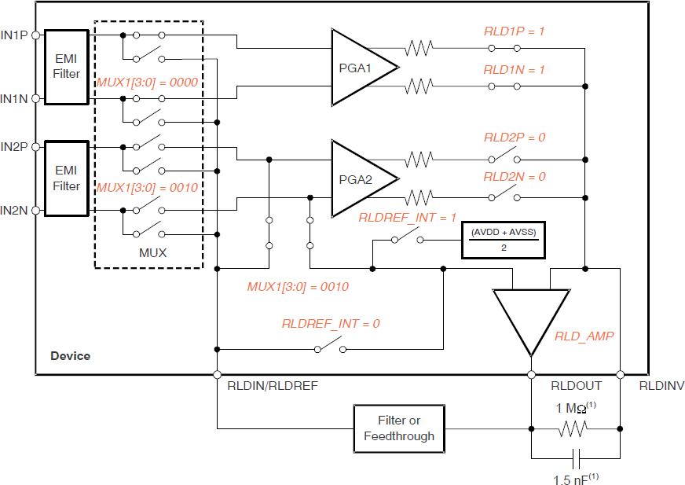

#### 2.9.3. Lead-Off Detection

Patient electrode impedances are known to decay over time. It is necessary to continuously monitor these electrode connections to verify a suitable connection is present. The basic principle is to inject an excitation signal and measure the response to find out if the electrode is off. The device provides two different methods of determining the state of the patient electrode. The methods differ in the frequency content of the excitation signal.

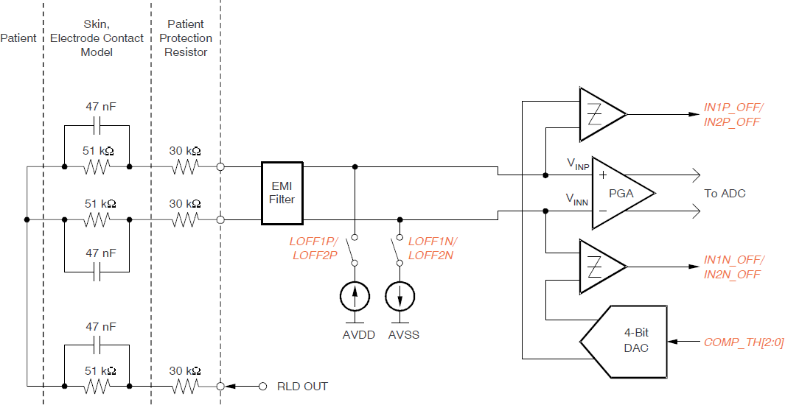

In the first method, the lead-off excitation is with a dc signal. The dc excitation signal can be chosen from either an external pull-up or pull-down resistor or a current source or sink. In case of current source or sink, the magnitude of the current can be set. The current source or sink gives larger input impedance compared to the 10 MΩ pull-up or pull-down resistor.

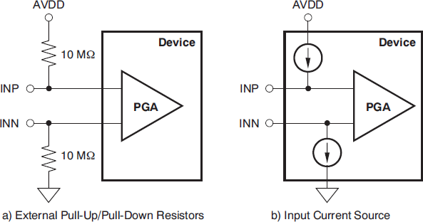

Sensing of the response can be done either by looking at the digital output code from the device or by monitoring the input voltages with an on-chip comparator. If either of the electrodes is off, the pull-up resistors and the pull-down resistors saturate the channel. By looking at the output code it can be determined that either the P-side or the N-side is off. To pinpoint which one is off, the comparators must be used. The input voltage is also monitored using a comparator and a 4-bit DAC whose levels are also configurable. The output of the comparators are stored in the LOFF_STAT register. These two registers are available as a part of the output data stream. If dc lead-off is not used, the lead-off comparators can be powered down.

In the AC method, an out-of-band AC signal is used for excitation. The AC signal is generated by alternatively providing an internal current source and current sink at the input with a fixed frequency. This out-of-band excitation signal is passed through the channel and measured at the output. Sensing of the AC signal is done by passing the signal through the channel to digitize it and measure at the output. The AC excitation signals are introduced at a frequency that is above the band of interest, generating an out-of-band differential signal that can be filtered out separately and processed. By measuring the magnitude of the excitation signal at the output spectrum, the lead-off status can be calculated. Therefore, the AC lead-off detection can be accomplished simultaneously with the ECG signal acquisition.

### 2.10. Respiration-Specific Functions

The ADS1292R provides two options for respiration: internal respiration with external clock and internal respiration with internal clock. 

In the internal respiration with internal clock mode, the internal modulation and demodulator circuitry can be selectively used. The modulation signal is a square wave of the magnitude VREFP – AVSS. When the internal modulation circuitry is used, the output of the modulation circuitry is available at the RESP_MODP and RESP_MODM pins of the device. This availability allows custom filtering to be added to the square wave modulation signal. In this mode, GPIO1 and GPIO2 can be used for other purposes. The modulation frequency of the respiration circuit is set by the RESP_FREQ bits.

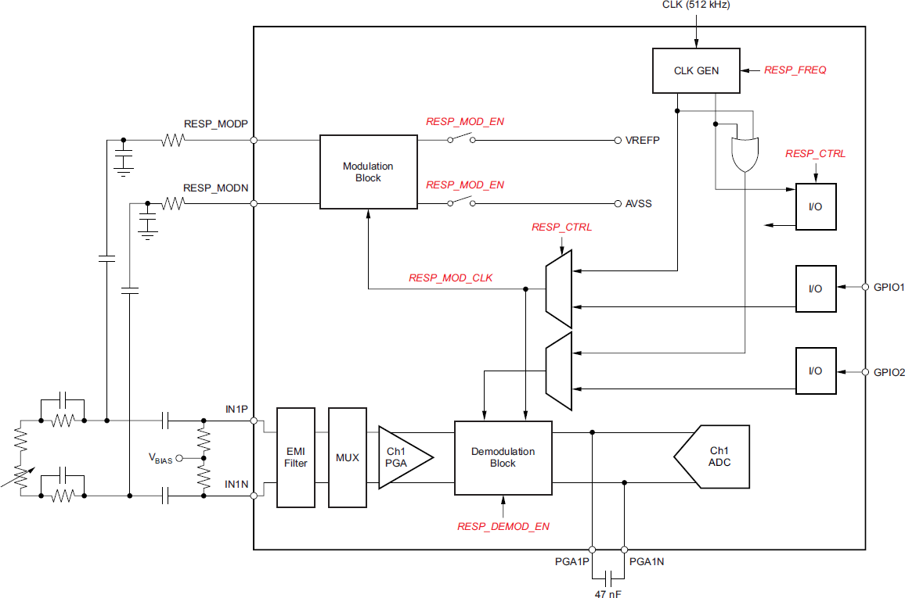

In the internal respiration with external clock mode, GPIO1 and GPIO2 are automatically configured as clock inputs and therefore, cannot be used for other purposes. An external, synchronous master clock (CLK) is required for this mode in order to operate.

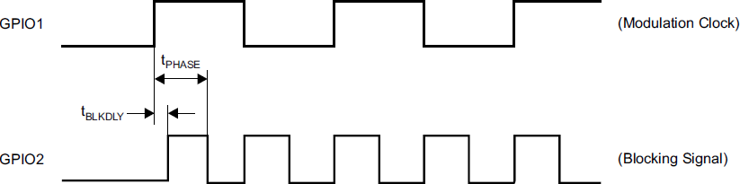

### 2.11. Power Supply

AVDD should be as quiet as possible, but since AVDD provides the supply to the charge pump block and has transients at fCLK, it is important to eliminate the noise that is non-synchronous with the device operation. Each supply should be bypassed with a 10 μF and a 0.1 μF solid ceramic capacitors. In systems where the board is subjected to high or low frequency vibration, it is recommend that a non-ferroelectric capacitor such as a tantalum or class 1 capacitor (for example, C0G or NPO) be installed. EIA class 2 and class 3 dielectrics (such as X7R, X5R, X8R, and such) are ferroelectric. The piezoelectric property of these capacitors can appear as electrical noise coming from the capacitor. When using internal reference, noise on the VCAP1 node results in performance degradation.

The device can be connected to a unipolar or a bipolar supply. The Protocentral ADS1292R Breakout Board is connected to a single supply source, as ilustrated in the image below. The board connects both supplies to 3.3 V. Since, the board is using the channel 1 respiration function, the PGA1 has is a 47 nF capacitor instead of the 4.7 nF ilustrate in the datasheet. Its unclear if the Protocentral staff also placed a 47 nF capacitor at the PGA2 (instead of the recommended 4.7 nF capacitor) or if its a documentation typo.

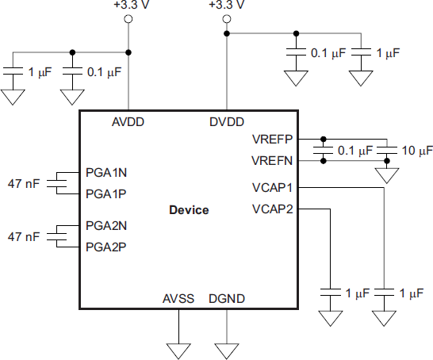

### 2.12. Register Map

- 00h ID: ID Control Register (Factory-Programmed, Read-Only)
  - Bits[7:5] => REV_ID[7:5]: Revision identification
    - 010 = ADS1x9x device
    - 011 = ADS1292R device
  - Bits[1:0] => REV_ID[1:0]: Revision identification
    - 00 = ADS1191
    - 01 = ADS1192
    - 10 = ADS1291
    - 11 = ADS1292 and ADS1292R

- 01h CONFIG1: Configuration Register 1
  - Bit 7 => SINGLE_SHOT: Single-shot conversion
    - 0 = Continuous conversion mode (default)
    - 1 = Single-shot mode
  - Bits[2:0] => DR[2:0]: Channel oversampling ratio
    - 000 = 125 SPS
    - 001 = 250 SPS
    - 010 = 500 SPS (default)
    - 011 = 1 kSPS
    - 100 = 2 kSPS
    - 101 = 4 kSPS
    - 110 = 8 kSPS

- 02h CONFIG2: Configuration Register 2
  - Bit 7 => Must be set to '1'
  - Bit 6 => PDB_LOFF_COMP: Lead-off comparator power-down
    - 0 = Lead-off comparators disabled (default)
    - 1 = Lead-off comparators enabled
  - Bit 5 => PDB_REFBUF: Reference buffer power-down
    - 0 = Reference buffer is powered down (default)
    - 1 = Reference buffer is enabled
  - Bit 4 => VREF_4V: Enables 4 V reference
    - 0 = 2.42 V reference (default)
    - 1 = 4.033 V reference
  - Bit 3 => CLK_EN: CLK connection
    - 0 = Oscillator clock output disabled (default)
    - 1 = Oscillator clock output enabled
  - Bit 1 => INT_TEST: Test signal selection
    - 0 = Off (default)
    - 1 = On; amplitude = ±(VREFP – VREFN) / 2400
  - Bit 0 => TEST_FREQ: Test signal frequency
    - 0 = At dc (default)
    - 1 = Square wave at 1 Hz

- 03h LOFF: Lead-Off Control Register
  - Bits[7:5] => COMP_TH[2:0]: Lead-off comparator threshold
    - 000 = 95%  / 5% (default)
    - 001 = 92.5% / 7.5%
    - 010 = 90% / 10%
    - 011 = 87.5% / 12.5%
    - 100 = 85% / 15%
    - 101 = 80% / 20%
    - 110 = 75% / 25%
    - 111 = 70% / 30%
  - Bit 4 => Must be set to '1'
  - Bits[3:2] => ILEAD_OFF[1:0]: Lead-off current magnitude
    - 00 = 6 nA (default)
    - 01 = 22 nA
    - 10 = 6 μA
    - 11 = 22 μA
  - Bit 0 => FLEAD_OFF: Lead-off frequency
    - 0 = At dc lead-off detect (default)
    - 1 = At ac lead-off detect at fDR / 4 (500 Hz for an 2 kHz output rate)

- 04h CH1SET: Channel 1 Settings
  - Bit 7 => PD1: Channel 1 power-down
    - 0 = Normal operation (default)
    - 1 = Channel 1 power-down(1)
  - Bits[6:4] => GAIN1[2:0]: Channel 1 PGA gain setting
    - 000 = 6 (default)
    - 001 = 1
    - 010 = 2
    - 011 = 3
    - 100 = 4
    - 101 = 8
    - 110 = 12
  - Bits[3:0] => MUX1[3:0]: Channel 1 input selection
    - 0000 = Normal electrode input (default)
    - 0001 = Input shorted (for offset measurements)
    - 0010 = RLD_MEASURE
    - 0011 = MVDD(2) for supply measurement
    - 0100 = Temperature sensor
    - 0101 = Test signal
    - 0110 = RLD_DRP (positive input is connected to RLDIN)
    - 0111 = RLD_DRM (negative input is connected to RLDIN)
    - 1000 = RLD_DRPM (both positive and negative inputs are connected to RLDIN)
    - 1001 = Route IN3P and IN3N to channel 1 inputs

(1) When powering down channel 1, make sure the input multiplexer is set to input short configuration. Bits[3:0] = 001.
(2) For channel 1, (MVDDP – MVDDN) is [0.5(AVDD + AVSS)]; for channel 2, (MVDDP – MVDDN) is DVDD / 4. Note that to avoid saturating the PGA while measuring power supplies, the gain must be set to '1'.

- 05h CH2SET: Channel 2 Settings
  - Bit 7 => PD2: Channel 2 power-down
    - 0 = Normal operation (default)
    - 1 = Channel 2 power-down(1)
  - Bits[6:4] => GAIN2[2:0]: Channel 2 PGA gain setting
    - 000 = 6 (default)
    - 001 = 1
    - 010 = 2
    - 011 = 3
    - 100 = 4
    - 101 = 8
    - 110 = 12
  - Bits[3:0] => MUX2[3:0]: Channel 2 input selection
    - 0000 = Normal electrode input (default)
    - 0001 = Input shorted (for offset measurements)
    - 0010 = RLD_MEASURE
    - 0011 = VDD / 2 for supply measurement
    - 0100 = Temperature sensor
    - 0101 = Test signal
    - 0110 = RLD_DRP (positive input is connected to RLDIN)
    - 0111 = RLD_DRM (negative input is connected to RLDIN)
1000 = RLD_DRPM (both positive and negative inputs are connected to     - RLDIN)
    - 1001 = Route IN3P and IN3N to channel 2 inputs

(1) When powering down channel 2 and for ADS1291, make sure the input multiplexer is set to input short configuration. Bits[3:0] = 001.

- 06h RLD_SENS: Right Leg Drive Sense Selection
  - Bits[7:6] => CHOP[1:0]: Chop frequency
    - 00 = fMOD / 16
    - 10 = fMOD / 2
    - 11 = fMOD / 4
  - Bit 5 => PDB_RLD: RLD buffer power
    - 0 = RLD buffer is powered down (default)
    - 1 = RLD buffer is enabled
  - Bit 4 => RLD_LOFF_SENSE: RLD lead-off sense function
    - 0 = RLD lead-off sense is disabled (default)
    - 1 = RLD lead-off sense is enabled
  - Bit 3 => RLD2N: Channel 2 RLD negative inputs
    - 0 = Not connected (default)
    - 1 = RLD connected to IN2N
  - Bit 2 => RLD2P: Channel 2 RLD positive inputs
    - 0 = Not connected (default)
    - 1 = RLD connected to IN2P
  - Bit 1 => RLD1N: Channel 1 RLD negative inputs
    - 0 = Not connected (default)
    - 1 = RLD connected to IN1N
  - Bit 0 => RLD1P: Channel 1 RLD positive inputs
    - 0 = Not connected (default)
    - 1 = RLD connected to IN1P

- 07h LOFF_SENS: Lead-Off Sense Selection
  - Bit 5 => FLIP2: Current direction selection
    - 0 = Disabled (default)
    - 1 = Enabled
  - Bit 4 => FLIP1: Current direction selection
    - 0 = Disabled (default)
    - 1 = Enabled
  - Bit 3 => LOFF2N: Channel 2 lead-off detection negative inputs
    - 0 = Disabled (default)
    - 1 = Enabled
  - Bit 2 => LOFF2P: Channel 2 lead-off detection positive inputs
    - 0 = Disabled (default)
    - 1 = Enabled
  - Bit 1 => LOFF1N: Channel 1 lead-off detection negative inputs
    - 0 = Disabled (default)
    - 1 = Enabled
  - Bit 0 => LOFF1P: Channel 1 lead-off detection positive inputs
    - 0 = Disabled (default)
    - 1 = Enabled

- 08h LOFF_STAT: Lead-Off Status
  - Bit 6 => CLK_DIV : Clock divider selection
    - 0 = fMOD = fCLK / 4 (default, use when fCLK = 512 kHz)
    - 1 = fMOD = fCLK / 16 (use when fCLK = 2.048 MHz)
  - Bit 4 => RLD_STAT: RLD lead-off status
    - 0 = RLD is connected (default)
    - 1 = RLD is not connected
  - Bit 3 => IN2N_OFF: Channel 2 negative electrode status
    - 0 = Connected (default)
    - 1 = Not connected
  - Bit 2 => IN2P_OFF: Channel 2 positive electrode status
    - 0 = Connected (default)
    - 1 = Not connected
  - Bit 1 => IN1N_OFF: Channel 1 negative electrode status
    - 0 = Connected (default)
    - 1 = Not connected
  - Bit 0 => IN1P_OFF: Channel 1 positive electrode status
    - 0 = Connected (default)
    - 1 = Not connected

- 09h RESP1: Respiration Control Register 1
  - Bit 7 => RESP_DEMOD_EN1: Enables respiration demodulation circuitry
    - 0 = RESP demodulation circuitry turned off (default)
    - 1 = RESP demodulation circuitry turned on
  - Bit 6 => RESP_MOD_EN: Enables respiration modulation circuitry
    - 0 = RESP modulation circuitry turned off (default)
    - 1 = RESP modulation circuitry turned on
  - Bits[5:2] => RESP_PH[3:0]: Respiration phase(1)
    - RESP_CLK at 32kHz / 64 kHz
    - 0000 = 0° / 0° (default)
    - 0001 = 11.25° / 22.5°
    - 0010 = 22.5° / 45°
    - 0011 = 33.75° / 67.5°
    - 0100 = 45° / 90°
    - 0101 = 56.25° / 112.5°
    - 0110 = 67.5° / 135°
    - 0111 = 78.75° / 157.5°
    - 1000 = 90° / Not available
    - 1001 = 101.25° / Not available
    - 1010 = 112.5° / Not available
    - 1011 = 123.75° / Not available
    - 1100 = 135° / Not available
    - 1101 = 146.25° / Not available
    - 1110 = 157.5° / Not available
    - 1111 = 168.75° / Not available
  - Bit 1 => Must be set to '1'
  - Bit 0 => RESP_CTRL: Respiration control
    - 0 = Internal respiration with internal clock
    - 1 = Internal respiration with external clock

(1) The RESP_PH3 bit is ignored when RESP_CLK = 64 kHz.

- 0Ah RESP2: Respiration Control Register 2
  - Bit 7 => CALIB_ON: Calibration on
    - 0 = Off (default)
    - 1 = On
  - Bit 2 => RESP_FREQ: Respiration control frequency (ADS1292R only)
    - 0 = 32 kHz (default)
    - 1 = 64 kHz
  - Bit 1 => RLDREF_INT: RLDREF signal
    - 0 = RLDREF signal fed externally
    - 1 = RLDREF signal (AVDD – AVSS) / 2 generated internally (default)
  - Bit 0 => Must be set to '1'

- 0Bh GPIO: General-Purpose I/O(1) Register
  - Bits[3:2] => GPIOC[2:1]: GPIO 1 and 2 control
    - 0 = Output
    - 1 = Input (default)
  - Bits[1:0] => GPIOD[2:1]: GPIO 1 and 2 data

(1) GPIO is not available in certain respiration modes.

## Theory of Operation

When the RLD amplifier is powered on, the current source has no function. Only the comparator can be used to sense the voltage at the output of the RLD amplifier. The comparator thresholds are set by the same LOFF[7:5] bits used to set the thresholds for other negative inputs.

Throughout this document, fCLK denotes the signal frequency at the CLK pin, tCLK denotes the signal period of the CLK pin, fDR denotes the output data rate, tDR denotes the output data time period, and fMOD denotes the frequency at which the modulator samples the input.

